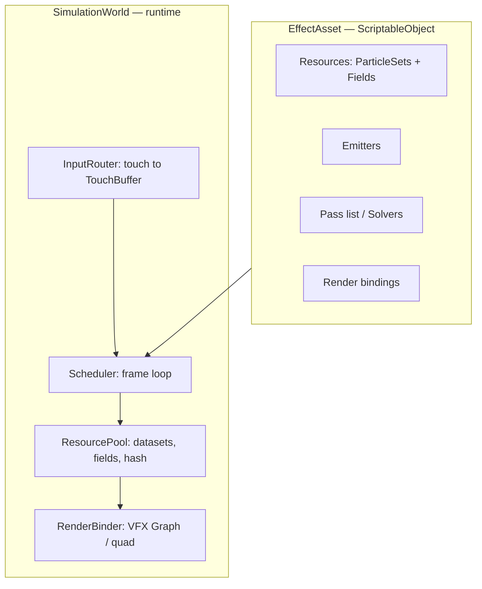

# Архитектура фреймворка GPU-симуляций (M3D Framework)

**Дата:** 2026-07-26
**Статус:** Milestone 1 + Milestone 2a (Field foundation) реализованы (см. `DOC/status.md`)
**Онбординг:** [`getting-started.md`](getting-started.md)
**Стек:** Unity 6 · URP · Compute Shaders · VFX Graph (renderer) · UniTask
**Платформа:** Android (Vulkan) / iOS (Metal), тач-управление, GPU-first

---

## Цель

Фреймворк для быстрой сборки и тестирования интерактивных GPU-симуляций на мобильных:
fluids (Magic Fluids / paveldogreat), boids/flocking, particle fields, procedural noise,
sand, soft bodies, morphing, reactive effects — для satisfying-приложений, казуальных игр
и TikTok/Reels-контента.

Приоритеты: простота · расширяемость · мобильная производительность · wow-эффект.

---

## Главная идея

> **Данные бывают двух видов — Particles (SoA-буферы) и Fields (grid-текстуры).
> Вычисления бывают одного вида — Pass (dispatch compute-kernel-а с декларированными reads/writes).**

Все остальные сущности — производные:

| Сущность        | Что это на самом деле                                                          |
| --------------- | ------------------------------------------------------------------------------ |
| **Emitter**     | Pass, который *пишет* новые частицы (burst / continuous / touch-driven)        |
| **Operator**    | Pass, преобразующий particles или field                                        |
| **Solver**      | именованный переиспользуемый *набор* Pass-ов (fluid = advect→pressure→project) |
| **SpatialHash** | сервисный ресурс: строится Pass-ами, читается другими Pass-ами                 |
| **Interaction** | тачи → `TouchBuffer` (буфер сил), доступный любому Pass-у                      |
| **Renderer**    | биндинг буфера/текстуры в VFX Graph или на quad                                |

Почему Fields — первоклассная сущность, а не «потом»: Magic Fluids и fluid-приложения
Догреата — это **не частицы**, а 2D grid-based Stable Fluids (velocity + dye текстуры).
Частицами такое на мобилке не сделать. Boids/sand — наоборот, частицы. Без полей
фреймворк покрывает половину целевых эффектов.

---

## Структура системы



### EffectAsset (ScriptableObject)

Один эффект = один ассет: какие ресурсы нужны, какие пассы в каком порядке, какие
параметры exposed. Аналог `.hip`-файла Houdini / VFX-графа, но **реордерабельным списком
в инспекторе** — 90 % пользы нод-графа за 5 % стоимости. EffectAsset = пресет:
скопировал, поменял пассы и параметры — новый эффект.

### SimulationWorld

Эволюция `SimulationRunner`: владеет ресурсами, гоняет цикл кадра, ничего не знает о
конкретных эффектах.

### Контракт Pass-а

Развитие текущего `IGPUOperator`:

```csharp
public abstract class SimPass : ScriptableObject
{
    public abstract IReadOnlyList<ResourceRequest> Reads { get; }
    public abstract IReadOnlyList<ResourceRequest> Writes { get; }  // атрибуты частиц И поля
    public abstract void Initialize(SimContext ctx);
    public abstract void Execute(SimContext ctx, float dt);
}
```

`ResourceRequest` — обобщение `AttributeId` на поля (`FieldId("velocity", RG16F, resolution)`).
Декларации reads/writes дают: валидацию пайплайна, автосоздание ресурсов,
автоматический ping-pong для полей.

`SimContext` — datasets, fields, `TouchBuffer`, dt, время, счётчики.

---

## Pipeline кадра

Фиксированный порядок фаз; внутри фаз — порядок из EffectAsset:

```
1. Input      : тачи → TouchBuffer (StructuredBuffer<TouchForce>, N ≤ 5)
2. Emit       : эмиттеры добавляют/реюзают частицы, сплатят dye/force в поля
3. Structure  : построение spatial hash / инжект частиц в поля (P2G)
4. Simulate   : solver-пассы (fluid project, boids steering, noise advect...)
5. Integrate  : velocity → position, границы, lifetime
6. Render     : биндинг буферов в VFX Graph / dye-текстуры на quad
```

Ключевое: **spatial hash и поля строятся один раз за кадр и шарятся между пассами**.

Весь pipeline пишется в `CommandBuffer` и сабмитится один раз (меньше overhead драйвера,
бесплатное профилирование пассов `ProfilingSampler`-ами).

---

## Единая система или раздельные симуляции

**Единая инфраструктура, раздельные solver-пакеты.** Универсальный солвер не строим:
fluid, boids и sand математически разные. Но у них общие ресурсы, цикл, ввод, рендер.

| Слой          | Общий? | Содержимое                                             |
| ------------- | ------ | ------------------------------------------------------ |
| Data          | общий  | `PointDataset`, `FieldSet`, ping-pong                  |
| Services      | общий  | SpatialHash, TouchBuffer, noise HLSL, prefix sum       |
| Пассы/солверы | пакеты | `FluidSolver2D`, `BoidsSolver`, `SandSolver`, morphing |
| Композиция    | общий  | EffectAsset, Scheduler, RenderBinder                   |

Wow-эффекты почти всегда гибриды (частицы в fluid-поле, boids от density-поля), поэтому
coupling particles↔fields (splat P2G, sample G2P) — сервис фреймворка, а не деталь солвера.

---

## Spatial hash, соседи, силы

### Spatial hash (boids, sand, SPH)

Counting sort, 4 фиксированных пасса (не bitonic — тот болеет на мобильных драйверах):

```
1. Hash     : cell = floor(pos / cellSize); key = hash(cell)   → keys[]
2. Histogram: InterlockedAdd(cellCounts[key], 1)
3. Scan     : prefix sum по cellCounts                          → cellStarts[]
4. Scatter  : частицы → sortedIndices[] по cellStarts
```

Соседи — итерация 9 (2D) / 27 (3D) ячеек через `cellStarts/cellCounts`.
Параметры: cellSize = радиус взаимодействия, таблица ~2× частиц, `numthreads(64,1,1)`.
Prefix sum — отдельный переиспользуемый сервис (нужен и для compaction частиц).

### Дешёвая альтернатива для flocking

Точные соседи для boids на мобилке часто не нужны: splat velocity/density частиц в грубое
поле (64×64), blur, каждая частица читает «среднюю скорость стаи» (alignment/cohesion) и
градиент плотности (separation). O(n) без сортировки. Точный hash — для sand/SPH,
где нужны настоящие контакты.

### Силы и тачи

```hlsl
struct TouchForce { float2 pos; float2 delta; float radius; float strength; };
```

Маленький StructuredBuffer, обновляется с CPU каждый кадр. Потребители:

- **поля**: splat-пасс рисует импульс и dye в velocity/dye поля (механика Magic Fluids);
- **частицы**: force-пасс `F = falloff(dist) * delta`.

Обобщение — `IForceProvider` (touch, gravity, curl noise, attractors, поле-как-сила);
каждый — просто Pass, пишущий в `velocity`.

---

## Удобство экспериментов

1. **Новый оператор = 2 файла по конвенции**: `Ops/X.hlsl` (чистая функция + kernel) и
   `Ops/XPass.cs` (декларация reads/writes + параметры). Codegen обвязки — позже, не сразу.
2. **Параметры через `[SerializeField]` + push каждый кадр** — live-tweaking в Play Mode.
   Rest-based модель обязательна: параметры реагируют мгновенно, ничего не накапливается.
3. **EffectAsset = пресет** — контент satisfying-приложений.
4. **Debug-пассы**: любое поле на quad (velocity → RG-цвет), любой атрибут частиц → color.
5. **Горячая пересборка**: кнопка Rebuild (disable/enable) без перезапуска Play Mode.

---

## Мобильные ограничения (влияют на архитектуру)

- **Bandwidth — главный лимит** (tile-based GPU): только используемые атрибуты (SoA уже
  даёт), поля `R16F/RG16F`, 2D 256×256 достаточно для wow, разрешение полей = параметр качества.
- **VFX Graph требует compute-capable API** — Vulkan/Metal; на GLES3 не работает.
  Поэтому **RenderBinder — абстракция**: VFX Graph — одна из реализаций, рядом quad-рендер
  (для 2D fluid dye) и fallback `Graphics.RenderPrimitives` + шейдер, читающий те же буферы.
- **Никаких readback-ов в кадре**; `AsyncGPUReadback`/UniTask только вне горячего пути.
- Диспатчей на кадр ~10–20; итерации Jacobi pressure-солвера (20–30) = параметр качества №1.

---

## Resource-oriented principles (M2a)

1. **Доменные симуляции = композиции Pass**, не отдельные подсистемы (Fluid/Boids).
2. **Унификация на Resource Registry / FieldRequest**, не на общем compute-kernel.
3. **Simulation Resources** (`ParticleSet`, `FieldSet`) ≠ **services** (TouchBuffer, CommandBuffer, Render binders).
4. **Field ownership (C):** EffectAsset декларирует поля; пассы только ссылаются; runtime не автосоздаёт. Editor: Materialize missing fields.
5. **FieldAccess:** `Read` / `WriteInPlace` (splat, без swap) / `WritePingPong` (World вызывает `Swap` после пасса — но только если пасс реально записал dispatch, см. `SimPass.LastExecuteDispatched`; пассы про ping-pong не знают).
6. **Ноль аллокаций в кадре:** декларации `FieldReads`/`FieldWrites` читаются World-ом каждый кадр, поэтому массивы `FieldRequest` кэшируются (`FieldRequestSets.Single`), как `AttrSets` у частиц.
7. **Plane basis** принадлежит `FieldDescriptor`, не `InputRouter`.
8. **DoD M2a:** hybrid `Touch → velocity field → particles → render` без special-case веток в `SimulationWorld`.

Particle attributes по-прежнему авторегистрируются; fields — только из деклараций (намеренная асимметрия).

---

## Эволюция из текущего кода

| Было | Стало |
| --- | --- |
| Только `ParticleSet` | + `FieldSet` (dual RT, World-owned Swap) |
| `Reads`/`Writes` (attrs) | + `FieldReads`/`FieldWrites` (`FieldRequest`) |
| VFX bind в World | `IRenderBinder` (VFX + optional FieldQuad) |
| — | `HybridTouchField` demo |

**Milestone 1:** каркас частиц + ~17 пассов.  
**Milestone 2a (готово):** Field foundation + hybrid.  
**Дальше:** Stable Fluids → spatial hash/boids → emitters → richer hybrids.
