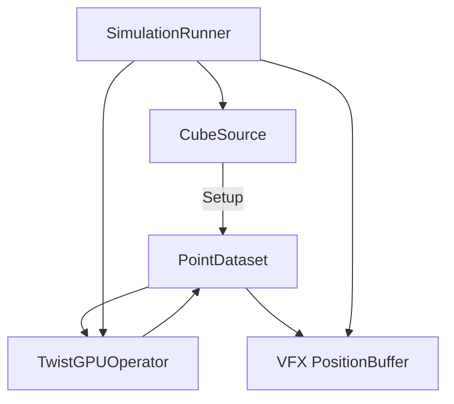

# Status — M3D Playground PoC

**Дата:** 2026-07-19  
**Итерация:** 3 — PointDataset + IDataSource  
**Проект:** Unity `6000.4.3f1` / URP / VFX Graph 17.x  
**Сцена:** `Assets/Scenes/Test1.unity`

---

## Цель

```
IDataSource → PointDataset (Schema + SoA buffers) → GPU Operators → VFX Graph
```

`Particle` больше не публичный контракт. Операторы и VFX работают с атрибутами (`position`), не с форматом источника.

---

## Архитектура




### Core


| Тип                 | Роль                                                                 |
| ------------------- | -------------------------------------------------------------------- |
| `AttributeId`       | ключ атрибута; словари dataset/schema: `Dictionary<AttributeId, …>`  |
| `BuiltinAttributes` | каталог стандарта (`Position`, `Value`) — static readonly согласован |
| `AttributeDescriptor` | Id, Type, Stride, Target (Count только у Dataset)                  |
| `AttributeSchema`   | read-only снаружи; Add только из PointDataset                        |
| `PointDataset`      | владелец schema+buffers; `RegisterAttribute` атомарно                |


Schema обновляется только через `RegisterAttribute` (descriptor + buffer атомарно).

### Sources

```csharp
public interface IDataSource
{
    string Name { get; }
    void Setup(PointDataset dataset);
    void Tick(PointDataset dataset);
}
```

Буферы владеет только `PointDataset`. У `IDataSource` нет `Dispose`.

**Сейчас:** `CubeSource` — сетка `resolution³` в `[-cubeSize/2, cubeSize/2]` → `BuiltinAttributes.Position`.

**Позже:** OBJ / PCache / Mandelbulb — тот же контракт.

### Operators

`IGPUOperator` + `TwistGPUOperator`: required `Position`, compute на `RWStructuredBuffer<float3> Positions`.

### Runtime

`SimulationRunner` (вместо `SimulationController`): source.Setup → twist → VFX bind `PositionBuffer` / `SpawnCount`.

---

## Как добавить новый IDataSource

1. Класс `XSource : IDataSource`
2. В `Setup`: `EnsureCapacity` + `RegisterAttribute` нужных builtins/custom + fill
3. `Tick` — empty или GPU update
4. Подставить в Runner вместо Cube — Twist/VFX не меняются, если есть `position`

---

## Файлы

```
Assets/Scripts/
  Core/          AttributeId, BuiltinAttributes, Descriptor, Schema, PointDataset
  Sources/       IDataSource, CubeSource
  Operators/     IGPUOperator, TwistGPUOperator
  Runtime/       SimulationRunner
  Editor/        CreateParticleBufferVFX.cs
Assets/Shaders/
  ParticleSimulate.compute
  GPU/Operators/ TwistOperator.hlsl, Operator.hlsl
  GPU/Vfx/       ReadPositionBuffer.hlsl
```

Удалено из публичного пути: `Particle.cs`, `ParticleStruct.hlsl`, AoS buffer.

---

## Проверка

- Play Mode, resolution=100 → ~1M points
- Twist крутит куб; strength/speed в Inspector
- Нет зависимости операторов/VFX от `Particle`

---

## Вне скоупа (ещё не сделано)

OBJ/PCache/Mandelbulb loaders, multi-source merge, PointDatasetBuilder, plugins, codegen.