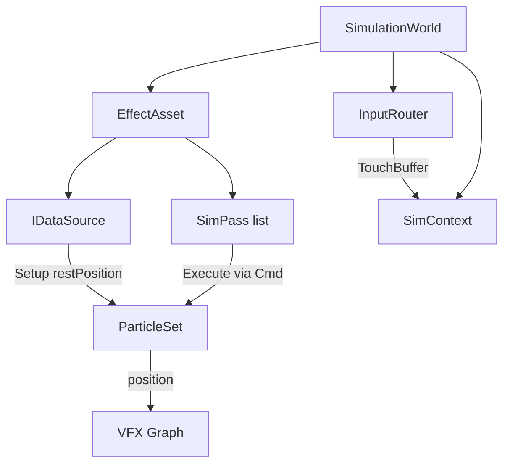

# Status — M3D Framework (Milestone 1)

**Дата:** 2026-07-23  
**Итерация:** 4.0 — SimulationWorld + EffectAsset + pass library  
**Проект:** Unity `6000.4.3f1` / URP / VFX Graph 17.x  
**Сцена:** `Assets/Scenes/Test1.unity`  
**Архитектура:** [`architecture.md`](architecture.md)

---

## Цель

```
IDataSource → ParticleSet (Schema + SoA) → SimPass pipeline → VFX Graph
```

Один эффект = один `EffectAsset` (источник + упорядоченный список пассов).  
Runtime — `SimulationWorld`: ресурсы, CommandBuffer-цикл, TouchBuffer, биндинг VFX.

---

## Архитектура



### Core

| Тип | Роль |
| --- | --- |
| `AttributeId` / `AttributeType` | ключ атрибута; stride через `GetStride()` |
| `BuiltinAttributes` | `RestPosition`, `Position`, `Velocity`, `Value` |
| `ParticleSet` | владелец schema+buffers; рост capacity после создания буферов запрещён |
| `AttributeSchema` | read-only снаружи |

Авторегистрация: мир собирает `Reads`/`Writes` всех пассов и регистрирует недостающие атрибуты (zero-fill).

### Sources

`IDataSource.Setup(ParticleSet)` пишет `restPosition`. Kind: `Cube` / `Mesh` / `Bitmap` (конфиг в EffectAsset).

Валидации: null/empty, texture/mesh `isReadable`, mesh degenerate bounds, bitmap `span > 0`.

### Passes (по роли в кадре)

| Категория | Пассы |
| --------- | ----- |
| **Shape** | `CopyRestPass`, `TwistPass`, `SpringToRestPass` |
| **Force** | `GravityPass`, `DragPass`, `VortexPass`, `AttractorPass`, `RepulsorPass`, `NoiseForcePass`, `CurlNoisePass`, `TurbulencePass`, `TouchForcePass` |
| **Dynamics** | `IntegratePass`, `SpeedLimitPass`, `PlaneColliderPass`, `SphereColliderPass`, `BoxBoundsPass` |

Каждый пасс = kernel в `.compute` + C#-класс (`ParticleKernelPass`).  
Буферы биндятся по имени атрибута (`position`, `velocity`, `restPosition`).  
Диспатчи идут в один `CommandBuffer` за кадр; каждый пасс в `ProfilingSampler`.

HLSL: `Assets/Shaders/GPU/Passes/{Shape,Force,Dynamics}Passes.compute` + `Includes/Noise.hlsl`, `Touch.hlsl`.

### Runtime

`SimulationWorld`:

1. `effect.ResolveSource()` → `Setup(particles)`
2. Авторегистрация атрибутов + one-time `restPosition → position` copy
3. `Initialize` каждого пасса (поиск kernel-а в pass library)
4. Bind VFX `PositionBuffer` / `SpawnCount`
5. Каждый кадр: Sample touches → Tick source → Execute passes → `Graphics.ExecuteCommandBuffer`

`InputRouter`: мышь (editor) / touch → `TouchForce[]` на GPU (≤8).

### Editor

| Меню / инспектор | Назначение |
| ---------------- | ---------- |
| EffectAsset inspector | Add Pass (меню по Category), reorder |
| SimulationWorld inspector | кнопка Rebuild (Play Mode) |
| `Tools/M3D/Create Demo Effects` | TwistedCube / GalaxySwirl / ReactiveDust |
| `Tools/M3D/Setup Open Scene` | вешает World + InputRouter на VFX |

---

## Демо-пресеты

| Asset | Пайплайн |
| ----- | -------- |
| `Assets/Effects/TwistedCube.asset` | CopyRest → Twist |
| `Assets/Effects/GalaxySwirl.asset` | Vortex → CurlNoise → Drag → TouchForce → Integrate → BoxBounds(Wrap) |
| `Assets/Effects/ReactiveDust.asset` | SpringToRest → Turbulence → TouchForce(push) → Drag → Integrate |

---

## Файлы

```
Assets/Scripts/
  Core/       AttributeId, BuiltinAttributes, Descriptor, Schema, ParticleSet
  Sources/    IDataSource, DataSourceKind, Cube/Mesh/BitmapSource
  Runtime/    EffectAsset, SimulationWorld, SimPass, SimContext, InputRouter
  Passes/     ShapePasses, ForcePasses, DynamicsPasses
  Editor/     EffectAssetEditor, SimulationWorldEditor, M3DDemoTools, CreateParticleBufferVFX
Assets/Shaders/GPU/
  Passes/     ShapePasses.compute, ForcePasses.compute, DynamicsPasses.compute
  Includes/   Noise.hlsl, Touch.hlsl
  Vfx/        ReadPositionBuffer.hlsl
Assets/Effects/   TwistedCube, GalaxySwirl, ReactiveDust
DOC/          architecture.md, status.md, capabilities.md
```

Удалено: `PointDataset`, `SimulationRunner`, `IGPUOperator` / Twist/Bulb/Copy operators, `ParticleSimulate.compute`, `GPU/Operators/*` (включая Bulb).

---

## Проверка

- Play Mode, TwistedCube → 1M points, 2 passes
- GalaxySwirl / ReactiveDust — переключение Effect на SimulationWorld + Rebuild
- Мышью в Game View крутить GalaxySwirl / ReactiveDust
- Mesh: Read/Write Enabled; Bitmap: Read/Write Enabled

---

## Вне скоупа (Milestone 2+)

- Fields / FieldSet / 2D Stable Fluids
- Spatial hash + boids
- Emitters + lifetime / compaction
- Appearance / Lifecycle pass categories (color, age)
- Android Vulkan билд
- Codegen C# ↔ HLSL
- Динамический VFX capacity под `particles.Count`
